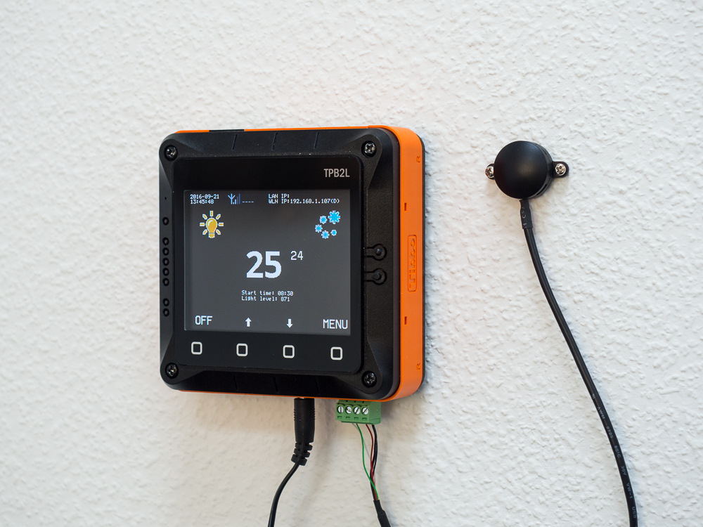
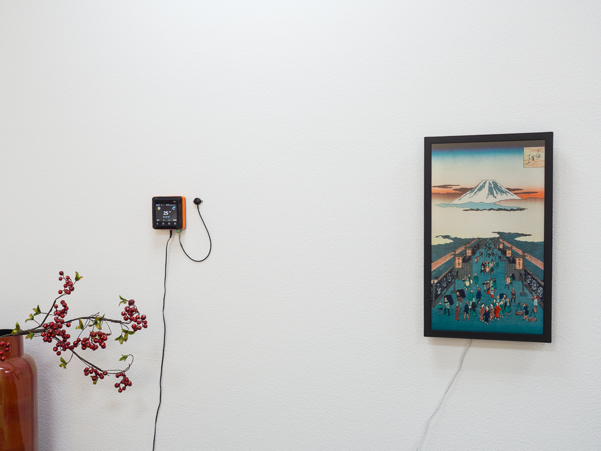

# TPS-based Office Aircon Controller Application

Air conditioning is a wasteful business, and air cons are expensive to run. Most aircon systems, especially older ones, do not have any real temperature feedback. The temperature you set on your remote has absolutely nothing to do with the actual temperature in the room. Even when the weather gets colder, many air conditioners continue to blast cold air into your space. As a result, you have to adjust and constantly readjust your room temperature.

Of course, air conditioning systems are getting smarter by the day, but the world is still full of older systems that will only retire many years from now. In some cases, this is not even a question of investing in a new system. Sometimes, it is just impossible to rip the old aircon out and put the new one in without undertaking a major interior renovation. Tibbo office in Taipei is stuck in exactly this situation. We just have to make do with the aircon we've got. Oh, and our aircon is controlled with infrared remotes. We have a dozen of them lying around.

Some time ago, we set out to create a management system for our dated HVAC system. As you would expect, we used our Tibbo Project System (TPS) for this endeavor. Our spec for the aircon controller consisted of exactly two items:

- We wanted the aircon to run or not run depending on whether the lights are on or off. Since this is an office, no lights = no people = no need to run the aircon.
- We wanted the device to monitor the actual temperature in the room and stop the aircon whenever the temperature cooled off to the preset point.

We have achieved our goal by using a TPS2L system equipped with these Tibbits:

- IR code processor Tibbit (#26)
- IR front-end Tibbit (#27)
- Ambient light sensor Tibbit (#28)
- Ambient temperature probe

Let us tell you about the probe. This is a new item that we will be announcing this fall. The probe replaces the ambient temperature meter (Tibbit #29). It is nice to have the meter built right into the TPS. The problem is, the meter is affected by the internal heat of the TPS system itself. This influence is especially noticeable for the TPS2L device - it's LCD really warms up the box! The new probe has the same circuit as the Tibbit #29, with the added benefit of being external to the TPS device. Now the measurements are accurate.

Here is a look at the items you need to set up in the menu:

**IR commands.** This is where you train your IR code processor to be able to transmit two commands: "On," and "Off." For the "On" command, use the lowest temperature that your aircon's remote allows you to set (usually 16 degrees C). The logic here is that when you need to lower the temperature in the room you can use the coldest temperature setting, and when the room cools down to the preset temperature, the aircon is turned off. So really, you only need two commands.

**Target temperature.** You don't need to set it here. There are dedicated buttons on the main screen.

**Pre-cool start time.** This is something we added along the way. Now it is possible to turn the aircon on, once a day, even before we all arrive at the office. Our day starts at 9 am. We set this time for 8:30 am, and by the time we get in, the office is nice and cool (while the scorching Taipei summer keeps on raging outside). The pre-cool timer is hardcoded for 45 minutes. If the lights are still off at 9:15 the aircon is turned off.

**Brightness threshold.** This is the brightness that the TPS will consider to correspond to "lights on." The value is not expressed in any standard measurement units; it's just the value the Tibbit #28 returns. So, how do you know what number to set here? Simple: the brightness is displayed on the main screen, like this: "Light level: 718". Note the value with the lights off and on, then set the threshold to some value in the middle between the two.

**Temp. meas. adjustment.** This is useful for when you choose to use the Tibbit #29. As we've explained above, its measurements are affected by the internal heat of the TPS itself. You can use a regular thermometer and determine the measurement error. For example, if your thermometer reads 25C, and TPS shows 28C, then you must adjust the temperature by 3 degrees C. The data returned by the new external probe need no adjustment. 

## Further work

In phase 2 of this project we will connect our aircon controller to an AggreGate server. It will be possible to control the system via a smartphone app, which we going to design for this purpose. Now you know why our configuration menu has items like Network, AggreGate, etc. Stay tuned!

